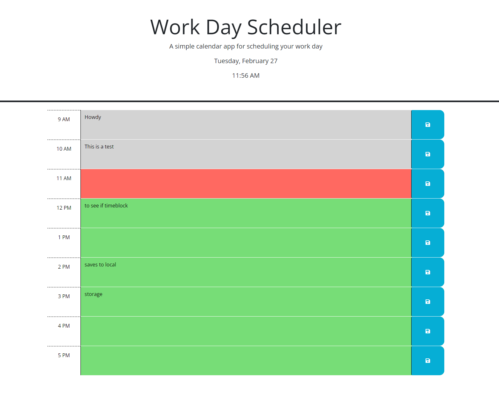

# Work Day Scheduler

This is a simple daily planner for people to input important events or tasks
so that they can better manage time effectively. The work day scheduler will 
display current date and current time as well as color code time blocks based 
on if the hour has passed (displayed as a grey block), if it is the current
hour (displayed as a red block), or if they hour is still in the 
future (displayed as a green block).

The image below displays the the application with filler text as an example

## Deployment

Deployed at 